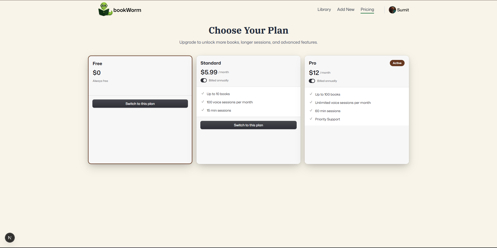
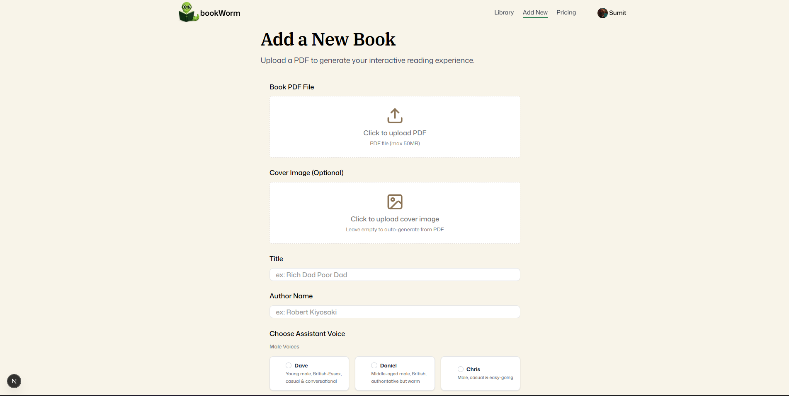

# bookWorm

A modern Next.js app that converts books into an interactive AI experience.
Upload PDFs, search book content, and chat with your books using voice-powered AI and subscription-managed access.

## Preview







## Overview

`bookWorm` is built with:

- Next.js 16
- React 19
- TypeScript
- Clerk for authentication
- MongoDB + Mongoose for persistent storage
- VAPI AI voice assistant integration
- PDF upload and book parsing
- Subscription and billing UI via Clerk pricing pages
- Tailwind CSS + shadcn/ui for styling

## Key Features

- User authentication with Clerk
- Book upload and PDF handling
- MongoDB-backed book metadata and segment storage
- Voice conversation control via VAPI and ElevenLabs voices
- Searchable book content
- Subscription management page
- Protected routes for authenticated users

## Project Structure

```text
bookworm/
├── .clerk/                       # Clerk auth config
├── app/                          # Next.js app routes and pages
│   ├── (root)/
│   │   └── page.tsx              # Home page
│   ├── books/
│   │   ├── [slug]/
│   │   │   └── page.tsx          # Book detail page with VAPI controls
│   │   ├── new/
│   │   │   └── page.tsx          # Upload new book page
│   │   ├── subscriptions/
│   │   │   └── page.tsx          # Subscription pricing page
│   │   ├── sign-in/
│   │   │   └── [[...sign-in]]/
│   │   │       └── page.tsx       # Clerk sign-in route
│   │   ├── sign-up/
│   │   │   └── [[...sign-up]]/
│   │   │       └── page.tsx       # Clerk sign-up route
│   │   ├── api/
│   │   │   ├── upload/
│   │   │   │   └── route.ts      # Blob upload API route
│   │   │   └── vapi/
│   │   │       └── search-book/
│   │   │           └── route.ts  # VAPI helper route
│   │   └── layout.tsx            # Root layout with Clerk provider
├── components/                   # Reusable UI components
│   ├── BannerSection.tsx
│   ├── BookCard.tsx
│   ├── BookSearchBar.tsx
│   ├── BooksSection.tsx
│   ├── FileUploader.tsx
│   ├── LoadingOverlay.tsx
│   ├── Navbar.tsx
│   ├── Transcript.tsx
│   ├── UplaodBook.tsx
│   ├── VapiControls.tsx
│   ├── VoiceSelector.tsx
│   └── ui/
│       ├── button.tsx
│       ├── form.tsx
│       ├── input.tsx
│       ├── label.tsx
│       ├── radio-group.tsx
│       └── sonner.tsx
├── database/                     # MongoDB connection and models
│   ├── mongoose.ts
│   └── models/
│       ├── bookModel.ts
│       ├── bookSegModel.ts
│       └── voiceSessionModel.ts
├── hooks/                        # Custom React hooks
│   ├── draft.ts
│   ├── useSubscription.ts
│   └── useVapi.ts
├── lib/                          # Shared utils and actions
│   ├── actions/
│   │   ├── book.actions.ts
│   │   └── session.actions.ts
│   ├── constants.ts
│   ├── subscriptionServer.ts
│   ├── types.ts
│   ├── utils.ts
│   └── zod.ts
├── preview/                      # Screenshot assets for this README
│   ├── preview 1.png
│   ├── preview 4.png
│   ├── preview2.png
│   └── preview3.png
├── next-env.d.ts
├── next.config.ts
├── package-lock.json
├── package.json
├── postcss.config.mjs
├── proxy.ts
├── README.md
├── tsconfig.json
└── types.d.ts
```

## Tech Stack

- Next.js 16
- React 19
- TypeScript
- Tailwind CSS v4
- Clerk Authentication
- MongoDB + Mongoose
- VAPI AI (`@vapi-ai/web`)
- PDF.js (`pdfjs-dist`)
- Vercel Blob Storage (`@vercel/blob`)
- Radix UI + shadcn/ui
- React Hook Form + Zod
- Sonner toast notifications
- Lucide icons

## Environment Variables

Create a `.env.local` file at the project root with the following values:

```env
MONGODB_URI=<your-mongodb-connection-string>
NEXT_PUBLIC_VAPI_API_KEY=<your-vapi-public-api-key>
NEXT_PUBLIC_ASSISTANT_ID=<your-vapi-assistant-id>
BLOB_READ_WRITE_TOKEN=<vercel-blob-read-write-token>
```

Additional Clerk environment variables are required for authentication and deployment:

- `CLERK_FRONTEND_API`
- `CLERK_PUBLISHABLE_KEY`
- `CLERK_SECRET_KEY`
- `CLERK_JWT_KEY`
- `CLERK_JWT_ISSUER`

### Clerk Setup Note

1. Create a Clerk application at https://dashboard.clerk.com.
2. In the Clerk dashboard, add a new frontend application and copy:
   - `Publishable key`
   - `Frontend API`
3. Under API keys, create a new secret key and copy:
   - `Secret key`
   - `JWT key`
   - `JWT issuer`
4. Add those values to `.env.local`.
5. Use the Clerk app URLs as the redirect callback for sign-in/sign-up if required by your Clerk app settings.

### VAPI Integration

1. Create a VAPI account and log in to the VAPI dashboard.
2. Create or select a voice assistant and copy the public API key.
3. Copy the assistant ID for the assistant you want to use.
4. Add these values to `.env.local`:

```env
NEXT_PUBLIC_VAPI_API_KEY=<your-vapi-public-api-key>
NEXT_PUBLIC_ASSISTANT_ID=<your-vapi-assistant-id>
```

5. In this app, `hooks/useVapi.ts` uses `NEXT_PUBLIC_VAPI_API_KEY` to initialize the VAPI client and `NEXT_PUBLIC_ASSISTANT_ID` to start the assistant.
6. If your assistant requires custom settings, configure them in the VAPI dashboard and ensure the assistant ID matches the one saved in `.env.local`.

> VAPI integration requires a valid assistant ID and public API key. The app loads voice controls on the book detail page via `components/VapiControls.tsx`.

## Setup Instructions

1. Clone the repository:

```bash
git clone <repo-url>
cd bookworm
```

2. Install dependencies:

```bash
npm install
```

3. Create `.env.local` with the required variables.

4. Start the development server:

```bash
npm run dev
```

5. Open the app in your browser:

```bash
http://localhost:3000
```

## Build and Production

To build the project for production:

```bash
npm run build
```

Start the production server locally:

```bash
npm start
```

## Development Notes

- The app uses `proxy.ts` to protect authenticated routes with Clerk middleware.
- `database/mongoose.ts` connects to MongoDB and caches the connection.
- `hooks/useVapi.ts` initializes the VAPI client and manages audio state.
- `lib/actions/book.actions.ts` is responsible for book creation, listing, and searching.
- `app/api/upload/route.ts` handles secure blob uploads for book files.

## Deploying

This app is ready to deploy to Vercel. Make sure your environment variables are configured in the Vercel dashboard, including Clerk and VAPI keys.

## License

This project is provided as-is. Update the README with your license details if needed.
